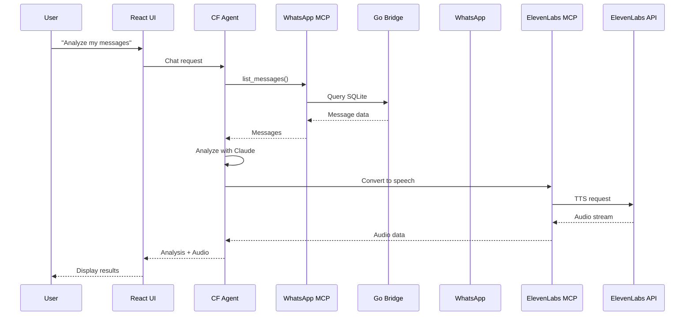

# Technical Architecture - WhatsApp Productivity AI Agent

## System Overview

The WhatsApp Productivity AI Agent is built on a modular architecture leveraging Cloudflare's edge computing platform and the Model Context Protocol (MCP) for service integration.

## Core Components

### 1. Cloudflare AI Agent (Frontend + Backend)

**Technology Stack:**

- React + TypeScript (Frontend)
- Cloudflare Workers (Backend)
- Anthropic Claude API
- Agents framework by Cloudflare

**Key Files:**

- `src/app.tsx` - React UI with chat interface
- `src/server.ts` - AI agent logic and MCP orchestration
- `src/tools.ts` - Tool definitions for agent capabilities

**Responsibilities:**

- User interface and interaction
- AI prompt management and response streaming
- MCP server orchestration
- Session and state management

### 2. WhatsApp MCP Server

**Architecture:**

```
┌─────────────────┐     ┌──────────────────┐     ┌─────────────────┐
│  Python MCP     │────▶│    Go Bridge     │────▶│  WhatsApp Web   │
│    Server       │     │   (whatsmeow)    │     │      API        │
└─────────────────┘     └──────────────────┘     └─────────────────┘
        │                        │
        ▼                        ▼
┌─────────────────┐     ┌──────────────────┐
│  HTTP API       │     │  SQLite DB       │
│  Port 8000      │     │  messages.db     │
└─────────────────┘     └──────────────────┘
```

**Components:**

- **Go Bridge** (`whatsapp-bridge/main.go`):

  - Handles WhatsApp Web authentication (QR code)
  - Maintains persistent connection
  - Syncs messages to local SQLite database
  - Built on whatsmeow library

- **Python MCP Server** (`whatsapp-mcp-server/main.py`):
  - Implements MCP protocol
  - Provides tools for message operations
  - Handles media downloads
  - Interfaces with Go bridge via SQLite

**Available Tools:**

- `search_contacts` - Find contacts by name/number
- `list_messages` - Retrieve messages with filters
- `send_message` - Send text messages
- `send_file` - Send media files
- `send_audio_message` - Send voice messages
- `download_media` - Download received media

### 3. ElevenLabs MCP Server

**Technology:**

- Python-based MCP implementation
- ElevenLabs API integration
- Audio streaming support

**Functionality:**

- Text-to-speech conversion
- Multiple voice options
- Streaming audio generation

### 4. Data Flow



## Security & Privacy

### Data Storage

- **Local-First**: All WhatsApp messages stored in local SQLite
- **No Cloud Sync**: Messages only sent to AI when explicitly requested
- **Encrypted Storage**: WhatsApp's E2E encryption maintained

### Authentication

- **WhatsApp**: Multi-device QR code authentication
- **API Keys**: Stored in `.dev.vars`, never exposed to client

### Network Security

- **MCP Proxy**: Isolates MCP servers from direct internet access
- **Localhost Only**: MCP servers bound to localhost
- **HTTPS**: Cloudflare Workers serve over HTTPS

